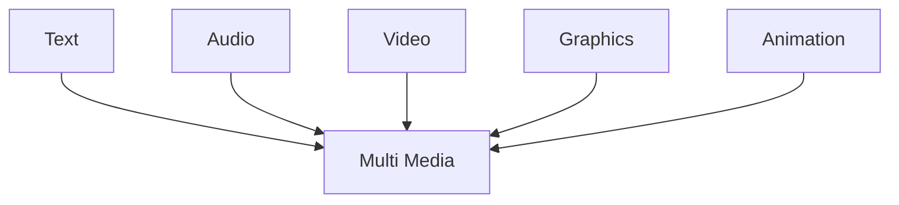

#it1
#### Definition
Multimedia refers to the integration of multiple forms of media such as text, graphics, images, audio, video, and animations to present information in an interactive and engaging manner. It enhances communication and user experience by combining different types of content.

#### 5 Elements of multimedia

##### Text 
- A broad term for something that contains words to express something. 
- Text is the most basic element of multimedia. 
- A good choice of words could help convey the intended message to the users (keywords). 
- Used in contents, menus, navigational buttons
##### Graphic
- Two-dimensional figure or illustration 
- Could be produced manually (by drawing, painting, carving, etc.) or by computer graphics technology. 
- Used in multimedia to show more clearly what a particular information is all about (diagrams, picture)
##### Audio
- Produced by vibration, as perceived by the sense of hearing. 
- In multimedia, audio could come in the form of speech, sound effects and also music score.
##### Animation
- The illusion of motion created by the consecutive display of images of static elements. 
- In multimedia, animation is used to further enhance / enriched the experience of the user to further understand the information conveyed to them
##### Video
- Is the technology of capturing, recording, processing, transmitting, and reconstructing moving pictures. 
- Video is more towards photo realistic image sequence / live recording as in comparison to animation. 
- Video also takes a lot of storage space. So plan carefully before you are going to use it.

---
#### Interactive Multimedia
1. **Multimedia**
	-  The combination of text, images, audio, video, and animations to present information interactively.
2. **Interactive Multimedia**
	- When the end user is allowed to control what and when the elements are delivered, it is called interactive multimedia. 
3. **Hypermedia**
	- When there exists a structure of linked elements through which the user can navigate, in the form of interactive multimedia, its called hypermedia
4. **Multimedia project**
	- A structured development process that involves creating multimedia content for applications such as education, entertainment, or business.
5. **Multimedia title**
	- When the project is to be shipped or sold to consumers or end users, typically delivered as a download on the Internet but also on a CD-ROM or DVD in a box or sleeve, with or without instructions, it is a multimedia title.

#### LINEAR 
A Multimedia Project is identified as Linear when:
- It is not interactive 
- User have no control over the content that is being showed to them.
**Example:** A movie, A non-interactive lecture / demo show

#### NON-LINEAR
A Multimedia Project is identified as Non-Linear when:
- It is interactive 
- Users have control over the content that is being showed to them.
- Users are given navigational control 
**Example:** Games, Courseware, Interactive CD

#### Authoring Tools 
- Use to merge multimedia elements (text, audio, graphic, animation, video) into a project. 
- Designed to manage individual multimedia elements and provide user interaction (if required).
**Example:** Macromedia Authorware, Macromedia Director, Macromedia Flash, Microsoft Power Point

#### Importance of Multimedia

| Business                                                                                                         | Education                                                                                                              | Entertainment                                                                                        |
| ---------------------------------------------------------------------------------------------------------------- | ---------------------------------------------------------------------------------------------------------------------- | ---------------------------------------------------------------------------------------------------- |
| - Sales / Marketing Presentation - Trade show production  - Staff Training Application  - Company Kiosk | - Use and Applications  - Courseware / Simulations  - E-Learning / Distance Learning  - Information Searching | - Use and Applications  - Games (Leisure / Educational)  - Movies  - Video on Demand–Online |

| Home                                                             | Public Places                                                              |
| ---------------------------------------------------------------- | -------------------------------------------------------------------------- |
| - Use and Applications  - IPTV  - Satellite TV  - Games | - Use and Applications  - Information Kiosk  - Smart Cards, Security |

---
### Multimedia Products

| Type                                | Definition                                                                                                                                                                      | Characteristics                                                                                                                                                                                                                                                                                                                                                                                                   | Examples                                                                                                             |
| ----------------------------------- | ------------------------------------------------------------------------------------------------------------------------------------------------------------------------------- | ----------------------------------------------------------------------------------------------------------------------------------------------------------------------------------------------------------------------------------------------------------------------------------------------------------------------------------------------------------------------------------------------------------------- | -------------------------------------------------------------------------------------------------------------------- |
| Briefing Products                   | Briefing products are **small, linear multimedia products** designed to present information **quickly and concisely**.                                                          | - Short Development Cycle – Created in a limited time frame.  - Limited Presentations – Used only a few times.  - Text-Focused – Primarily text-based with minimal graphics, audio, or video.  - Simple Navigation – Limited controls like mouse clicks or button presses for transitions.  - Audience-Specific – Content and format are tailored to the audience and presentation goals. | - Corporate Presentation   - Sales Presentation   - Educational Lectures                              |
| Reference Products                  | Reference products are **multimedia tools** used for answering **specific questions** or browsing **general information**, often stored on **CD/DVD ROMs**.                     | - **Wide User Range** – Suitable for all ages.  - **Navigation Features** – Includes menus, bookmarking, search, and printing utilities                                                                                                                                                                                                                                                                     | - Encyclopedias & Dictionaries  - Cookbooks, Historical & Informative Guides  - Scientific Surveys       |
| Database Products                   | Database products are **similar to reference products** but focus on **storing and accessing large multimedia data** such as **text, graphics, audio, animations, and videos**. | - **Manages Large Multimedia Data** – Efficient storage and retrieval.  - **Descriptive Finding Methods** – Allows **content-based searching**.  - **Simultaneous Access** – Supports multiple users (**online databases**).  - **Relational Consistency** – Ensures **structured and organized** data management.                                                                              | - **Google Search** – Retrieves data from the web.  - **Google Earth** – Provides geographic and spatial data. |
| **Education and Training Products** | Multimedia products designed for educational purposes.                                                                                                                          | N/A                                                                                                                                                                                                                                                                                                                                                                                                               | N/A                                                                                                                  |
| **Kiosk Products**                  | A product stationed at public places allowing users to find information interactively or conduct transactions.                                                                  | - Limited target users and usage. - User-friendly and easy to use. - Fast response.                                                                                                                                                                                                                                                                                                                         | - Instant Photo Booth - Banking Kiosk (money deposit, cheque) - University Information Kiosk                   |
| **Entertainment & Games**           | Most popular multimedia products, often shipped as interactive CDs/DVDs.                                                                                                        | - Immersive experience. - Requires constant feedback and interaction. - Challenging and intriguing for users. - Online play for multiple users.                                                                                                                                                                                                                                                          | N/A                                                                                                                  |
