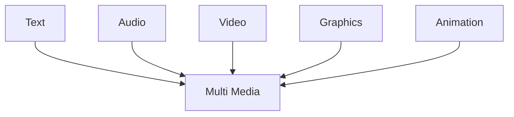

# INTRODUCTION TO MULTIMEDIA

#### Definition
Multimedia refers to the integration of multiple forms of media such as text, graphics, images, audio, video, and animations to present information in an interactive and engaging manner. It enhances communication and user experience by combining different types of content.

#### 5 Elements of multimedia

 

 